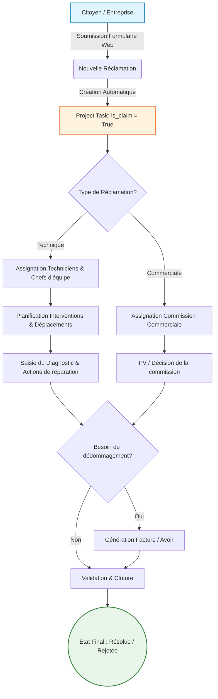

# Odoo Module : AlMiyahDZ - Gestion des Réclamations et Interventions

**AlMiyahDZ** est un module Odoo personnalisé conçu pour gérer les interventions, le suivi des réclamations via le portail web, et l'intégration avec la gestion de projets, de tâches et la facturation (factures rectificatives).

## Architecture et Flux de Travail

Voici le cycle de vie typique d'une réclamation dans l'application :

## Fonctionnalités Principales

### Gestion des Réclamations (Website & Portal)
- Soumission de réclamations directement via un formulaire public sur le site web (`website_claim.py`).
- Gestion de plusieurs origines : Citoyens, Entreprises et Cellule de veille.
- Attribution automatique d'un numéro de suivi (`claim_sequence.xml`).
- Espace dédié sur le portail web permettant aux clients de suivre l'état d'avancement de leurs requêtes.

### Gestion des Interventions et Actions
- Modèles spécifiques pour planifier et tracer les déplacements sur le terrain (`intervention_models.py`).
- Historique détaillé des actions de réparation, incluant le temps passé et les techniciens assignés.

### Extension des Tâches et Projets Odoo
- Enrichissement des tâches Odoo (`project.task`) avec de nouveaux champs : agence, type de réclamation, complexité, gravité, etc.
- Processus de traitement distincts selon la nature de la requête (technique vs commerciale).
- Saisie de diagnostics techniques et enregistrement des procès-verbaux (PV) de décisions.

### Facturation et Dédommagement
- Mécanisme intégré permettant la création de factures ou d'avoirs directement depuis la fiche de réclamation.
- Traçabilité assurée par un lien direct entre la réclamation et la pièce comptable (`account.move`).

### Sécurité et Organisation Multi-Agences
- Règles de sécurité personnalisées pour restreindre l'accès aux données en fonction de l'agence de rattachement de l'utilisateur.
- Assignation automatique des nouveaux employés et utilisateurs à leur agence locale.

## Structure du Module

- `controllers/` : Contrôleurs gérant les requêtes web publiques et les vues du portail client.
- `data/` : Fichiers structurels XML, comme la séquence de numérotation.
- `models/` : Modèles de données métier (`intervention_models.py`) et extension des standards Odoo (`project_task.py`, `inhereted_models.py`).
- `security/` : Fichiers définissant les groupes d'utilisateurs et les règles d'accès (Record Rules).
- `views/` : Interfaces backend (formulaires, listes) et templates frontend HTML/QWeb.

## Installation

1. Placez le dossier `AlMiyahDZ` dans le répertoire `addons` de votre instance Odoo (Version 18.0).
2. Redémarrez le service de votre serveur Odoo.
3. Connectez-vous à Odoo en tant qu'administrateur et activez le **Mode Développeur**.
4. Allez dans le menu **Applications**, puis cliquez sur **Mise à jour de la liste des applications**.
5. Cherchez le module **AlMiyahDZ** et cliquez sur **Activer/Installer**.

## Dépendances Techniques

Assurez-vous que les modules Odoo suivants sont présents sur votre base de données :
- `base`, `contacts`, `hr`
- `project`, `mail`, `calendar`
- `website`, `portal`
- `account`

## Licence

Consultez le fichier `LICENSE` inclus pour plus de détails sur les droits d'utilisation et de distribution. 
